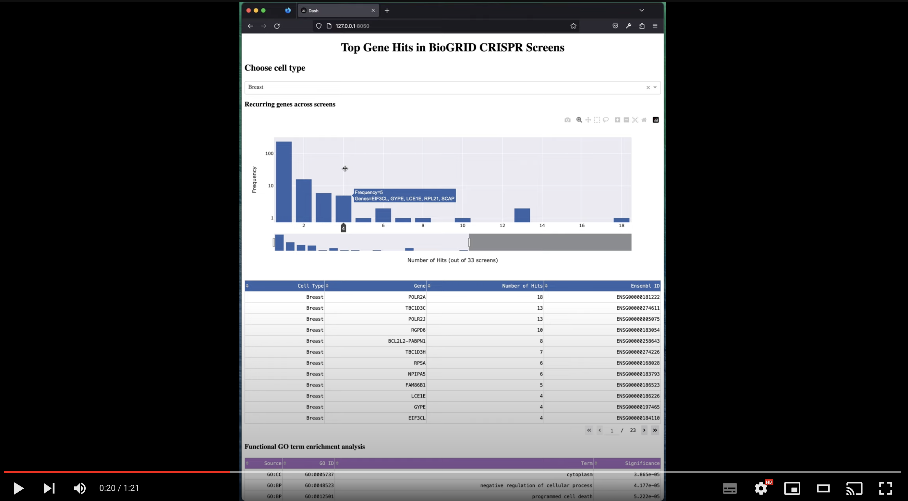

# Cambridge Gravity Biospark Challenge 2022/23

[](http://www.gravity.cam.ac.uk/ "Cambridge Gravity")
[](http://www.gravity.cam.ac.uk/bio-spark/ "Biospark")

This is the code repository for our project with a pharmaceutical company as part of Cambridge Gravity's [Biospark](http://www.gravity.cam.ac.uk/bio-spark/) programme. We designed a user-friendly, interactive platform to integrate and visualise pooled CRISPR screen data from [BioGRID ORCS](https://orcs.thebiogrid.org/), which allows us to discover and compare common gene hits across a plethora of human cell types.

[](https://www.youtube.com/watch?v=6jy8oFITiXo "App demo")

The app is written using the Plotly package in Python, with additional code in Bash, R and Python for data preprocessing. You can view a video demo of the app [here](https://www.youtube.com/watch?v=6jy8oFITiXo).

## Running the app
Download the repository.
```sh
git clone git@github.com:pittachalk/biospark.git
```

Download [Miniconda](https://docs.conda.io/en/latest/miniconda.html)/[Anaconda](https://www.anaconda.com/) and create the Conda environment with all the required dependencies.
```sh
cd biospark/
conda env create -f conda_env.yml
conda activate biospark
```

Run the app, which should be deployed on `localhost:8050`.
```sh
python script/app.py
```

The app has the following functionalities:

* Dropdown menu to choose between different cell types.
* Interactive bar charts to demonstrate frequently occuring gene hits across a particular cell type(s).
* Tables with sorting functionality.
* Functional enrichment with Gene Ontology.
* Double clicking a gene name to give pop-up information about said gene (you need to download the [Gene Information eXtension](https://gene-info.org/) Chrome extension).


## Diving deeper
If you're interested in diving deeper into the code used to process and clean the data, you can look under the subdirectory `script/`. The scripts are prefixed with a number to show the order in which they are meant to be run.

### R environment
You might wish to install a virtual environment for the R scripts using the `renv` dependency manager. Run `R` in the root of this repository, then type the following:
```r
install.packages("renv")

# then restart R
renv::activate()
renv::restore()
```

### Downloading additional data
The raw data files showing the hits from the CRISPR screens were not committed to the repository because of their large size. These were originally downloaded [here](https://downloads.thebiogrid.org/File/BioGRID-ORCS/Release-Archive/BIOGRID-ORCS-1.1.13/BIOGRID-ORCS-ALL-homo_sapiens-1.1.13.screens.tar.gz), with information about the file specification [here](https://wiki.thebiogrid.org/doku.php/orcs:downloads). We do include here an Excel version of the index file to easily browse the metadata of the screens.

To download the raw files:
```sh
cd data/
wget https://downloads.thebiogrid.org/Download/BioGRID-ORCS/Release-Archive/BIOGRID-ORCS-1.1.13/BIOGRID-ORCS-ALL-homo_sapiens-1.1.13.screens.tar.gz
tar -xzvf BIOGRID-ORCS-ALL-homo_sapiens-1.1.13.screens.tar.gz
rm BIOGRID-ORCS-ALL-homo_sapiens-1.1.13.screens.tar.gz 
```

### Other files
Inside `data/` is `metadata_celltype.csv`, which is our manual curation mapping of the cell lines (`CELL_TYPE`) into broader cell types (`CELL_TYPE_BROAD`).

`homo_sapiens_gene_id.txt` was downloaded from [NCBI](https://www.ncbi.nlm.nih.gov/gene/?term=Homo+sapiens) to resolve ambiguities between gene IDs.


